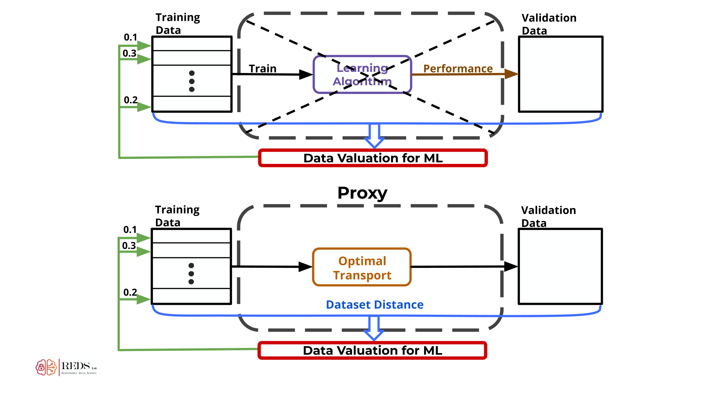
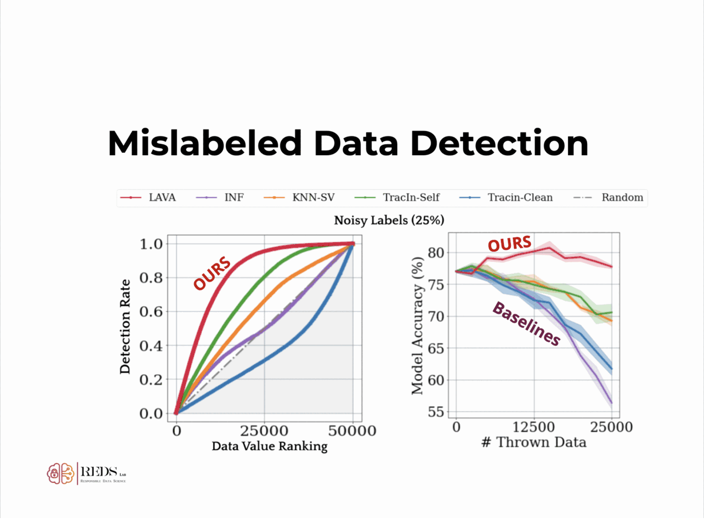

# LAVA: Data Valuation without Pre-Specified Learning Algorithms


This repository is the official implementation of the "[LAVA: Data Valuation without Pre-Specified Learning Algorithms](https://openreview.net/forum?id=JJuP86nBl4q)" (ICLR 2023). 


We propose LAVA: a novel model-agnostic framework to data valuation using a non-conventional, class-wise Wasserstein discrepancy. We further introduce an efficient way to measure datapoint contribution at no cost from the optimization solution.

## Limitations of traditional data valuation methods

Traditional data valuation methods **assume knowledge** of the underlying **learning algorithm**.

+ Learning algorithm is **unknown** prior to valuation
+ **Stochastic** training process => **Unstable** values
+ Model training => **Computational burden**

## Data Valuation via Optimal Transport

We propose data valuation via optimal transport to replace the current data valuation frameworks which rely on the underlying learning algorithm.



### Strong analytical properties of OT:

+ well-defined **distance metric**
+ computationally **tractable**
+ computable from **finite** samples

## LAVA: Individual Datapoint Valuation

To compute individual datapoint valuation, we propose the notion **calibrated gradient**, which measures sensitivity of the data point to the dataset distance by shifting the probability mass of the datapoint in the dual OT formulation.


$$Value(z_i) = \frac{\partial\text{OT}(\mu_t,\mu_v)}{\partial\mu_t(z_i)} = f_{i}^* -\sum_{j\in\{1, ... N\} \setminus i} \frac{f^*_j}{N-1}$$


+ **Exactly** the gradient of the dual formulation
+ Obtained **for free** when solving original OT problem

### Applications

<div align=center>

</div>

LAVA can be applied to numerous data quality applications:


+ Mislabeled Data
+ Noisy Features
+ Dataset Redundancy
+ Dataset Bias
+ Irrelevant Data
+ and more.


## Requirements

Install a virtual environment (conda).

```
conda env create -f environment.yaml python=3.8
```

## Getting Started

Load data package.

```python
import lava
```

Create a corrupted dataset and the index list of corrupted data points or create your own.

```python
loaders, shuffle_ind = lava.load_data_corrupted(corrupt_type='shuffle', dataname='CIFAR10', resize=resize, training_size=training_size, test_size=valid_size, currupt_por=portion)
```
                                        
Load a feature embedder.

```python
feature_extractor = lava.load_pretrained_feature_extractor('cifar10_embedder_preact_resnet18.pth', device)
```


Compute the **Dual Solution** of the Optimal Transport problem.

```python
dual_sol, trained_with_flag = lava.compute_dual(feature_extractor, loaders['train'], loaders['test'], training_size, shuffle_ind, resize=resize)
```

Compute the **Data Values** with LAVA + visualization.

```python
calibrated_gradient = lava.compute_values_and_visualize(dual_sol, trained_with_flag, training_size, portion)
```
                        
## Examples

For better understanding of applying LAVA to data valuation, we have provided examples on [CIFAR-10](example-cifar10.ipynb) and [STL-10](example-stl10.ipynb).

## Checkpoints

The pretrained embedders are included in the folder ['checkpoint'](checkpoint).


## Optimal Transport Solver
 
This repo relies on the [OTDD](https://github.com/microsoft/otdd) implementation to compute the class-wise Wasserstein distance. </br>
We are immensely grateful to the authors of that project.

